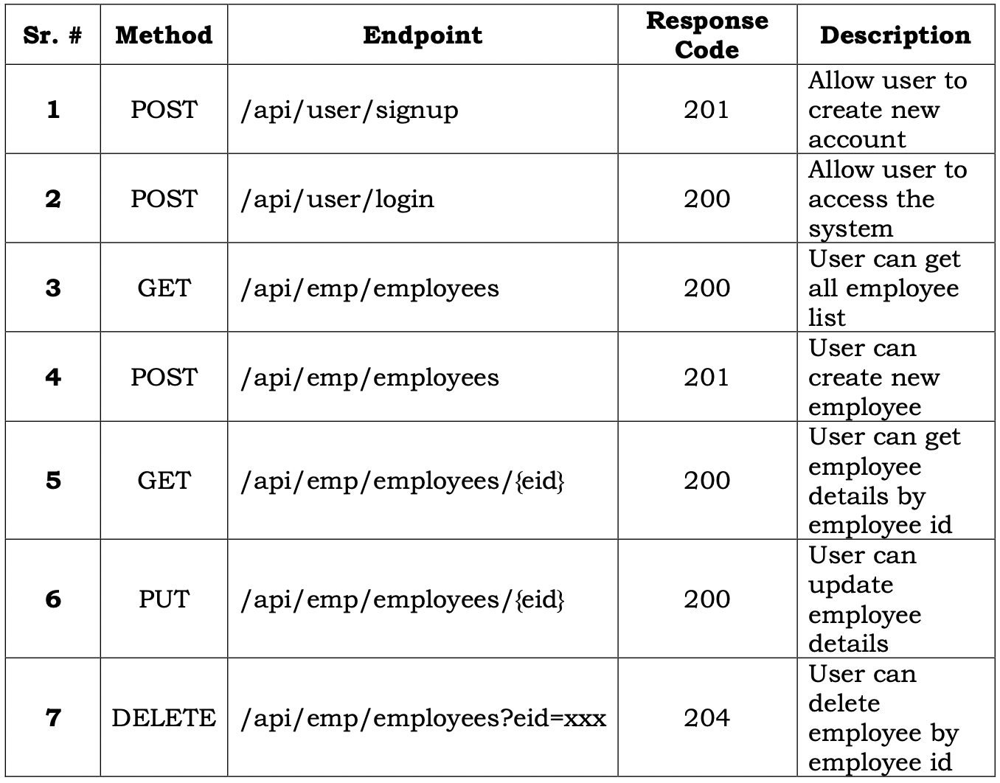

# COMP 3123 - Assignment 2

Develop a Frontend application using ReactJS built on [assignment 1](https://github.com/julienwidmer/101320111_COMP3123_Assignment1)

## Notes
* The Postman collection is available in the resources folder `./resources/Assignment 2.postman_collection.json`